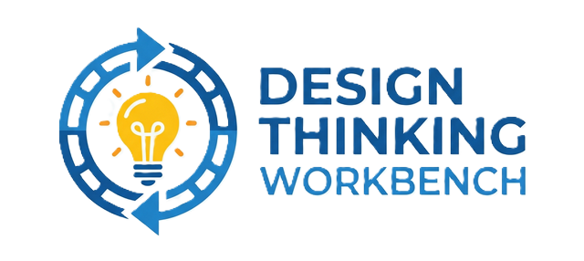
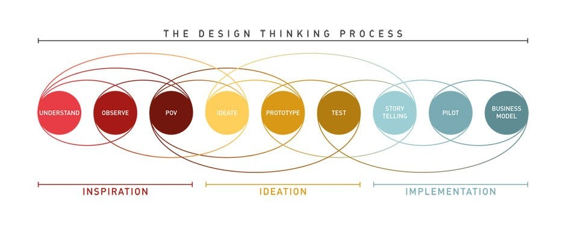

  
  
  # Design Thinking Workbench
  *A unified workspace centered around an AI Reasoner agent named "Domo"*

## Overview
The Design Thinking Workbench orchestrates a 10-step Design Thinking process, interacting with users via a primary chat interface and autonomously generating complex artifacts directly into integrated external tools (Miro, Notion, Google Workspace). It cryptographically eliminates cognitive bias by algorithmically enforcing validation and context preservation from raw observation to final execution.

## Features (MVP)
- **Domo, The AI Agent**: An active, autonomous agent functioning as a "Devil's Advocate" and unblocker.
- **Tabbed Navigation**: Seamlessly switch between Domo Chat, Miro, Notion, Google Workspace, and Google Calendar.
- **Companion App**: A mobile-accessible web app for real-time qualitative ingestion of interview transcripts and field observations.
- **Data Privacy (PII)**: Synchronous PII sanitization via Google Cloud DLP.
- **Dual-Database Architecture**: Dual-write architecture utilizing Neo4j Aura (Graph) and Vertex AI Vector Search (Semantic).

## The 10-Step Design Thinking Process

0. **Prep-work**: Define the initial scope, success criteria, and assemble the stakeholder team.
1. **Understand**: Gather secondary research, map the current market landscape, and identify constraints.
2. **Observe**: Gather primary qualitative data (interviews and context observations) from target users via the Companion App.
3. **POV**: Distill observations into actionable insights and define the core problem (audited by Domo).
4. **Ideate**: Generate a wide array of conceptual solutions based on the mathematically validated HMW statements.
5. **Prototype**: Build tactile, low-fidelity representations of the prioritized ideas to facilitate testing.
6. **Test**: Validate prototypes with users, identify failure points, and iterate.
7. **Storytelling**: Communicate the validated solution and rationale to executive stakeholders.
8. **Pilot**: Translate design artifacts into technical execution requirements for Agile teams.
9. **Business Model**: Ensure the validated solution aligns with a sustainable business strategy.

---
*For comprehensive product requirements, please see [MVP_01_PRD.md](./MVP_01_PRD.md).*
