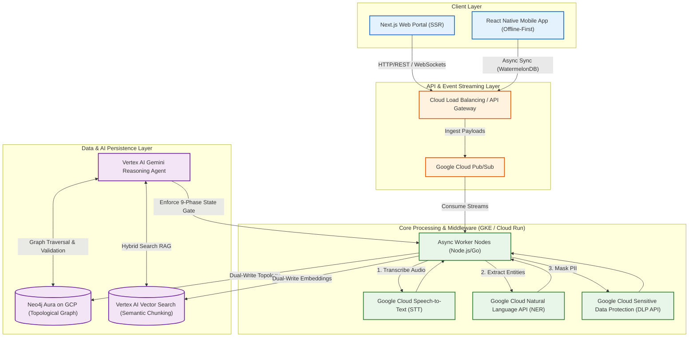
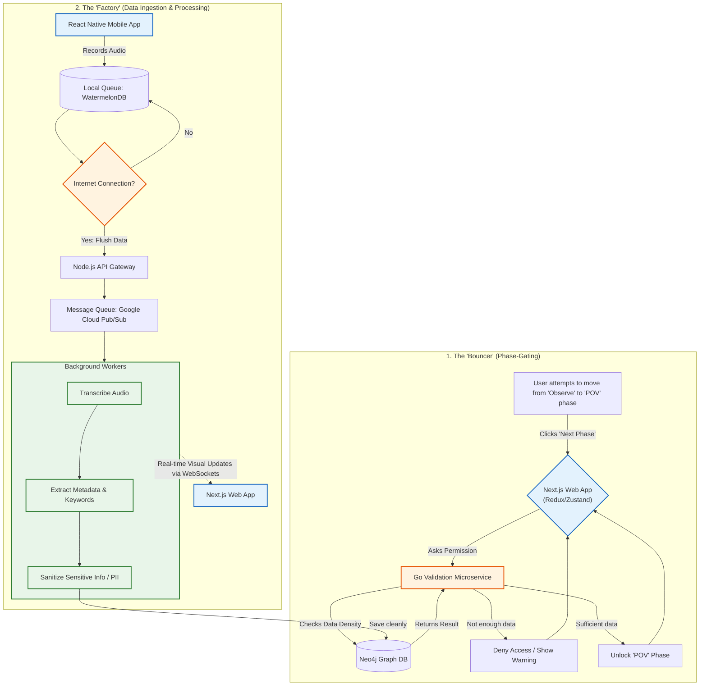
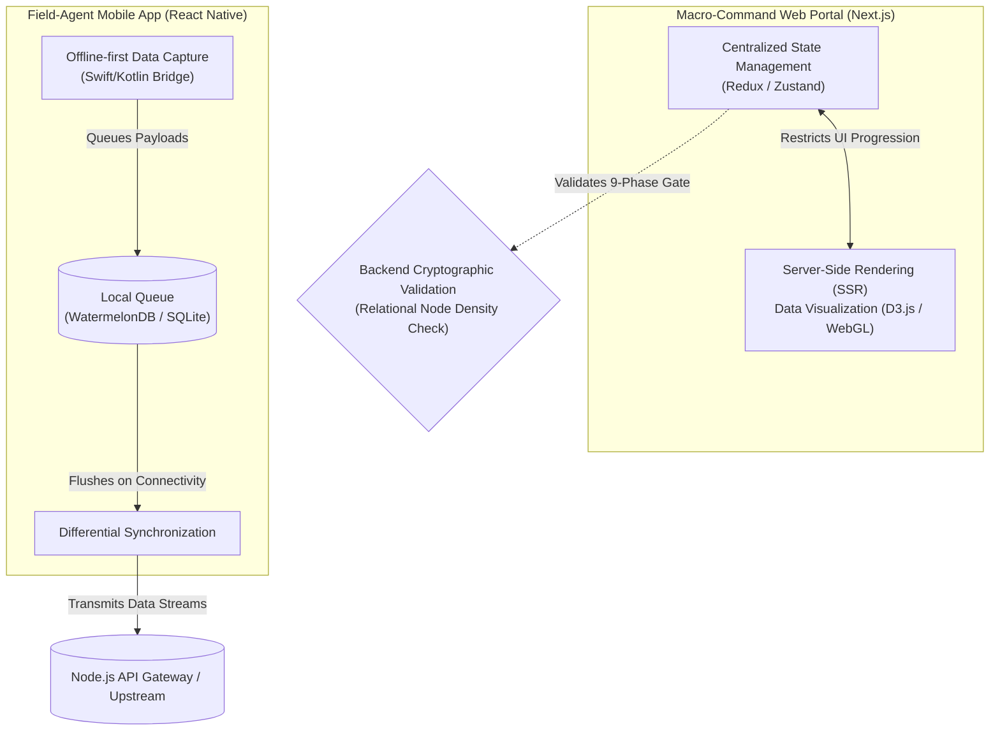
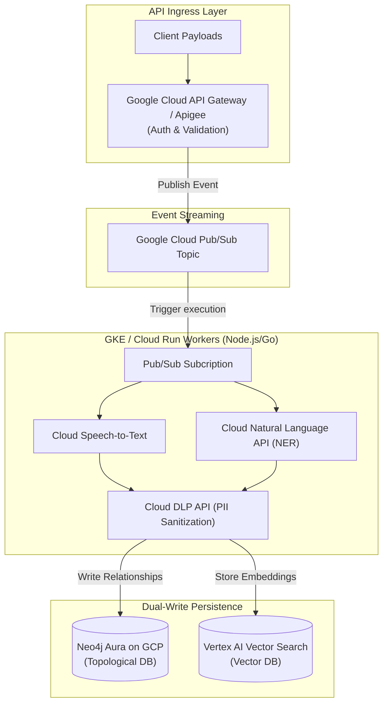
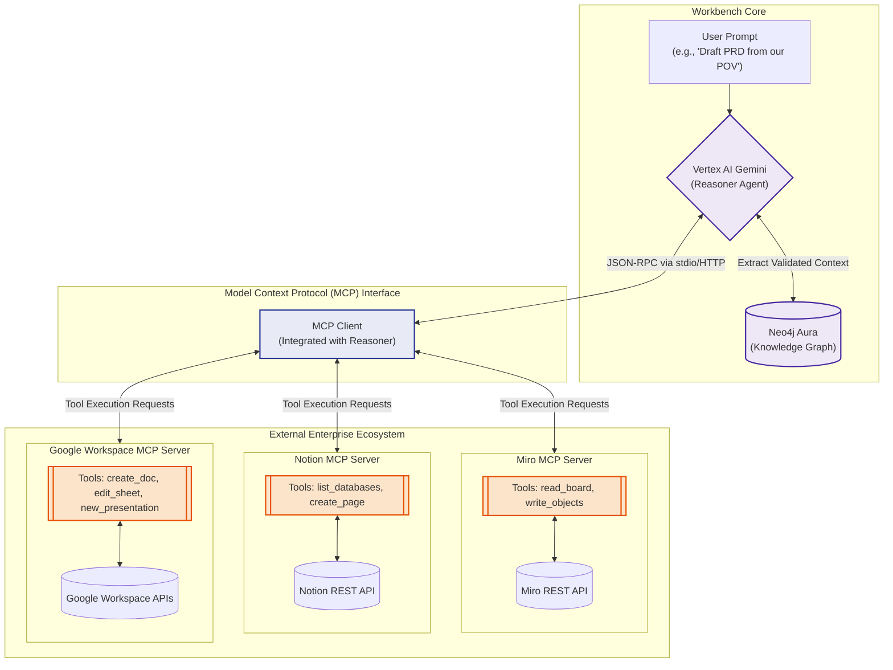
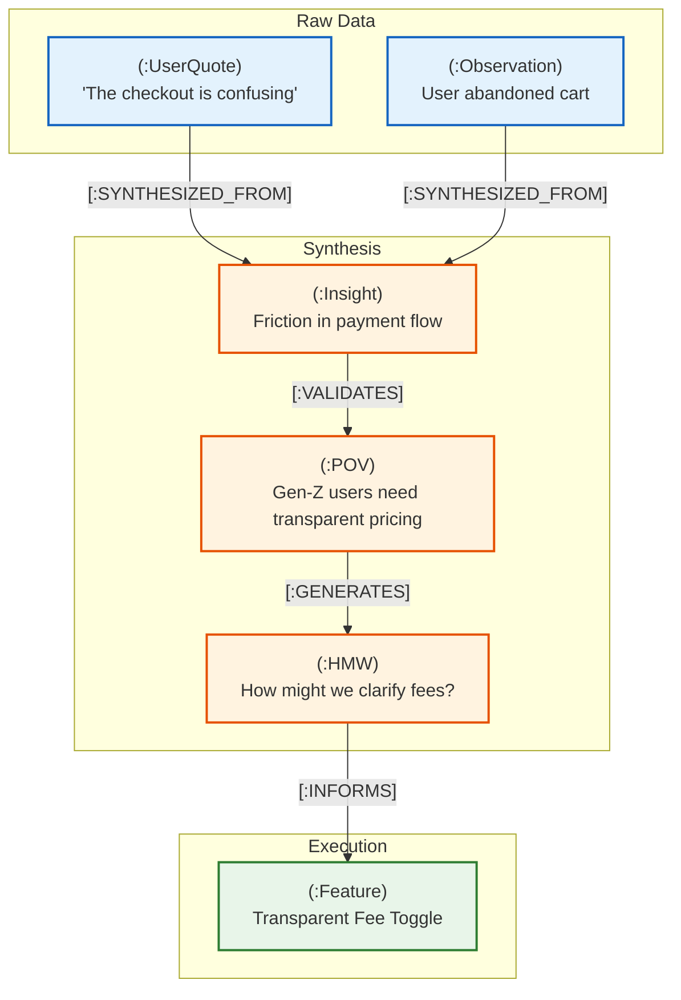
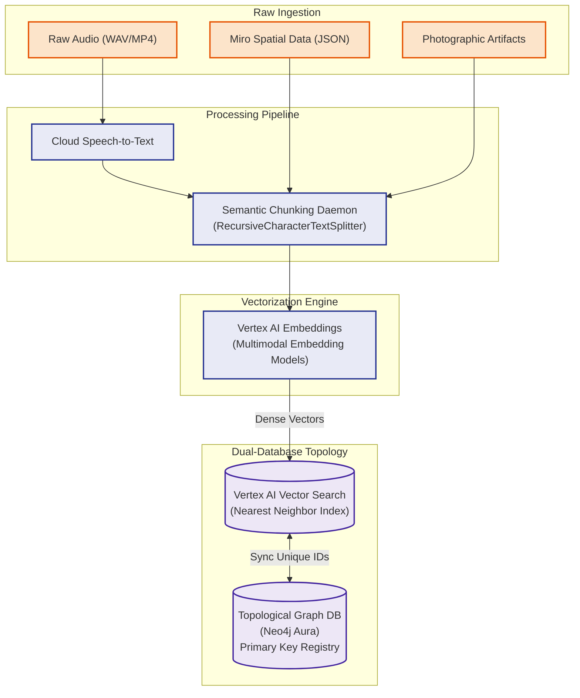
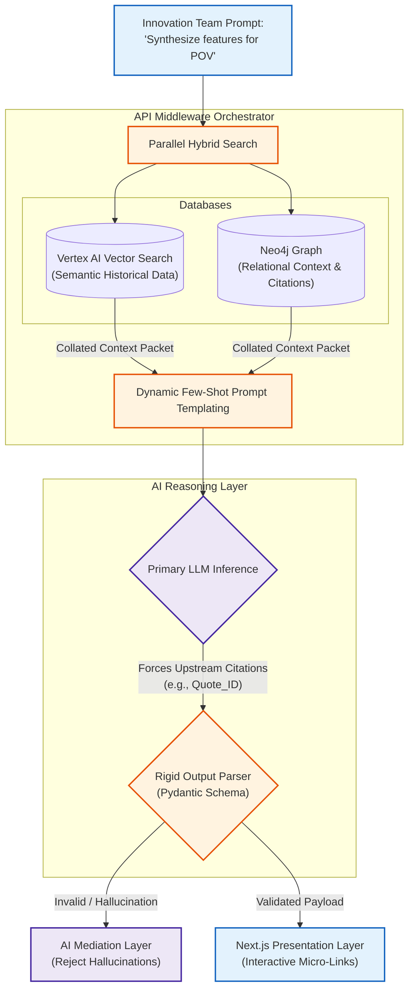
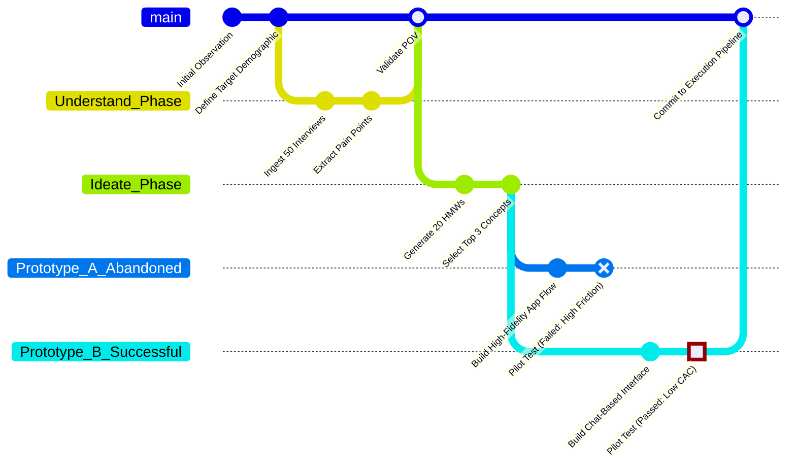

# WHITE PAPER OUTLINE: The Unified Design Thinking Workbench
## Architecting an LLM-Native Innovation Pipeline

# Table of Contents
1. [Executive Summary & Value Proposition](#1-executive-summary--value-proposition)
2. [System Architecture & Integrations](#2-system-architecture--integrations)
3. [Data Ontology & LLM Retrieval Strategy](#3-data-ontology--llm-retrieval-strategy)
4. [Zero-Friction Ingestion & PII Security](#4-zero-friction-ingestion--pii-security)
5. [Active Anti-Bias & Quality Control Engine](#5-active-anti-bias--quality-control-engine)
6. [Core Workbench Capabilities](#6-core-workbench-capabilities)
7. [The ROI Engine: From Empathy to Economics](#7-the-roi-engine-from-empathy-to-economics)
8. [The Adoption & Human Incentive Layer](#8-the-adoption--human-incentive-layer)
9. [The Artifact Translation Engine (The "Delivery" Bridge)](#9-the-artifact-translation-engine-the-delivery-bridge)
10. [Tokenomics & Infrastructure Cost Model (FinOps)](#10-tokenomics--infrastructure-cost-model-finops)
11. [Multiplayer State Management & Conflict Resolution](#11-multiplayer-state-management--conflict-resolution)

## 1. Executive Summary & Value Proposition

### 1.1 The Paradigm Shift: From Innovation Theater to a Deterministic Pipeline
The prevailing enterprise design thinking methodology—characterized by unstructured physical artifacts, qualitative echo chambers, and fragmented document stores—functions as non-deterministic "innovation theater." The Unified Design Thinking Workbench fundamentally deprecates this heuristic approach, introducing a rigidly typed, mathematically verifiable innovation pipeline. By cryptographically anchoring every downstream product requirement to an immutable, raw user data point via a Graph Database (e.g., Neo4j), the system guarantees state consistency across the entire 9-phase lifecycle (Inspiration to Implementation). This architectural paradigm shift enforces strict data ontology at the point of ingestion, enabling deterministic progression logic. Consequently, intuition-driven feature development is replaced by a traversable, algorithmic chain of custody, surfacing provable commercial viability before a single line of production code is compiled.

### 1.2 The Core Friction: Toolchain Fragmentation and Data Dead-Ends
Current innovation toolchains represent a highly distributed, N-tier architecture of non-communicative silos. Spatial ideation occurs in Miro (JSON/Canvas), qualitative capture in Zoom or Google Meet (MP4/VTT), and documentation in Notion or Google Docs (Markdown/Block data). This topology inherently generates persistent "data dead-ends." An insight synthesized on a digital whiteboard exists strictly as isolated presentation-layer data, semantically and relationally severed from the foundational user interview transcript that initiated it. This disjointed state machine prevents holistic data synthesis, precludes parallel scaling of research efforts, and causes extreme cognitive load as product managers manually poll and synchronize state across isolated APIs. Furthermore, without a unified Knowledge Graph, automated regression testing of UX hypotheses and retrospective architectural audits become computationally impossible, trapping enterprise teams in redundant, high-friction research cycles.

### 1.3 The Solution: An LLM-Native Central Nervous System
To resolve this infrastructural fragmentation, the Workbench operates as an LLM-native central nervous system, built upon an event-driven microservices architecture hosted on Google Cloud Run and GKE (Node.js/Go). It functions not as a passive data lake, but as an active orchestration layer driven by a dual-database topology: a topological Graph Database (Neo4j Aura on GCP) for strict relationship mapping (e.g., `(Interview)-[:GENERATES]->(Insight)-[:VALIDATES]->(Feature)`) paired synchronously with Google Cloud Vertex AI Vector Search for semantic Retrieval-Augmented Generation (RAG). Client-side ingestion via SSR-optimized Next.js portals and offline-first React Native edge clients immediately triggers high-throughput Google Cloud Pub/Sub event streams. These streams execute asynchronous data processing pipelines—utilizing Google Cloud Speech-to-Text for transcription and Google Cloud Natural Language API for Named Entity Recognition (NER)—before routing payloads through strict Google Cloud Sensitive Data Protection (DLP API) sanitization middleware. A primary reasoning LLM (Vertex AI Gemini) operating as a continuously polling background daemon traverses this unified, sanitized Graph, programmatically surfacing latent data correlations and strictly enforcing the 9-phase state machine.

### 1.4 Target Audience & ROI: Execution Mechanics & UI/UX Data Flows

The application targets :
* Enterprise Innovation Teams, 
* UX Researchers, 
* and Product Managers, 

delivering cryptographically provable ROI by compressing time-to-insight and algorithmically mitigating cognitive bias. 

**UI/UX Mechanics & Data Flow:**
The Next.js macro-command center employs strict, centralized state management (Redux/Zustand) to enforce phase-gating at the UI level. The presentation layer dynamically restrains user progression; an innovation team cannot advance the UI state from *Observe* to *POV* until a Go-based validation microservice confirms that the Neo4j cluster possesses a statistically significant density of validated node relationships. 

Data flows asynchronously and deterministically. Upon capturing localized audio via the React Native mobile client, WatermelonDB queues the blob at the edge. Upon network restoration, the payload is flushed to a Node.js API Gateway, queuing in Kafka. Background workers process the transcription, execute the NER metadata extraction, and sanitize PII. Crucially, the UI leverages WebSockets to stream real-time progression updates back to the front-end client, dynamically visualizing the ingestion process via WebGL or D3.js node-link diagrams. By actively offloading data entry and structural mapping to the asynchronous backend, human operators are restricted entirely to high-order synthesis, drastically multiplying organizational throughput while ensuring absolute compliance and mathematical traceability.

## 2. System Architecture & Integrations

### 2.1 Client-Side Architecture
The client presentation layer is bifurcated into two specialized interfaces, each strictly optimized for distinct phases of the data ingestion and synthesis pipeline. The macro-command Web Portal is built on a Next.js framework (React), leveraging server-side rendering (SSR) to handle computationally heavy data visualizations (via D3.js or WebGL) and manage the rigid phase navigation state machines. The client utilizes a centralized state management store (e.g., Redux or Zustand) to enforce the 9-phase gating constraints, immediately restricting UI progression until cryptographic backend validation confirms sufficient relational node density in the underlying graph.

Conversely, the Mobile Application, developed in React Native (with Swift/Kotlin native bridge optimizations), functions as the primary field-agent ingestion tool. It is fundamentally architected for offline-first capabilities. Utilizing an asynchronous local database (such as WatermelonDB or generic SQLite), the mobile client ensures zero-friction multimodal data capture—such as raw localized audio, photographic artifacts, and unstructured text—at the edge. Upon establishing network connectivity, differential synchronization protocols automatically flush the local message queues upstream.

### 2.2 Backend & Middleware Infrastructure
The core computational engine operates as an event-driven microservices architecture, horizontally scaled via Google Kubernetes Engine (GKE) and Cloud Run. All upstream ingress traffic is routed through Google Cloud API Gateway (or an Apigee ingress), which enforces JWT-based authentication, stringent rate-limiting, and payload schema validation.

Upon clearing the gateway, raw ingestion payloads are published directly into a distributed event streaming platform, specifically Google Cloud Pub/Sub. Independent worker nodes, orchestrated in high-concurrency languages like Go and Node.js, subscribe to these Pub/Sub topics to execute blocking, asynchronous heavy-lifting. For example, raw audio payloads trigger Google Cloud Speech-to-Text for precise transcription, immediately followed by Google Cloud Natural Language API for passive metadata extraction (NER).

Critically, before any data is authorized for persistence, the payload must transit through a strict PII sanitization middleware. Utilizing Google Cloud Sensitive Data Protection (DLP API), the system dynamically masks proper nouns, geographical locations, and specific demographic identifiers. Only scrubbed metrics are transmitted to the persistence layer to ensure absolute GDPR and CCPA compliance.

The cleansed data is then dual-written. Topological multi-modal relationships (e.g., mapping a raw user quote to a specific synthesized POV) are mapped into a Graph Database (Neo4j Aura on GCP). Simultaneously, the text payloads are semantically chunked, vectorized via Vertex AI Embeddings, and stored in Vertex AI Vector Search (or Cloud SQL for PostgreSQL via pgvector) to facilitate retrieval-augmented generation (RAG) by the active reasoning models.

*   **Observability & Distributed Tracing (To be developed...)** - Implementation of Google Cloud Operations Suite (Cloud Logging, Trace, Monitoring) for full lifecycle tracking of payloads and LLM reasoning steps across microservices.

### 2.3 Third-Party Integration Strategy (Model Context Protocol)
Interoperability with standard enterprise ecosystems is maintained not via brittle API middleware scripts, but through the **Model Context Protocol (MCP)**. This standardized architecture allows the primary Vertex AI Gemini Reasoning Agent to actively and securely interact with external tools as an autonomous extension of its cognitive loop. 

For collaborative spatial ideation, the AI agent connects to a dedicated **Miro MCP Server**, which exposes discrete tools for reading canvas geometry and writing sticky notes. If a user prompts the system, *"Organize the chaotic sticky notes on the Ideate board by sentiment"*, the LLM invokes the MCP `read_board` tool to ingest the unstructured spatial JSON, vectorizes and parses the data for cognitive bias, and subsequently invokes the `write_board` tool to dynamically rearrange or generate mathematically validated product archetypes directly on the canvas as structured topological configurations.

To facilitate downstream engineering delivery, an automated push mechanism leverages a **Notion/Confluence MCP Server**. Validated outputs—ranging from synthesized requirements to sanitization audit logs—are no longer passively compiled via webhooks. Instead, the Reasoner LLM autonomous evaluates the finalized project state, dynamically queries the Notion workspace for the correct product database schema using an MCP tool, and injects the rigorously formatted Product Requirements Document (PRD) directly into corporate knowledge bases. 

Further expanding its enterprise utility, the Workbench incorporates a **Google Workspace MCP Server**. This grants the reasoning agent the capability to natively synthesize its validated output directly into the Google ecosystem. Based on user prompts, the agent can autonomously draft strategy briefs in **Google Docs**, auto-generate stakeholder pitch decks in **Google Slides** (translating D3.js data visualizations into slide components), and compile quantitative ROI projections and Traceability Matrices into dynamic **Google Sheets**. This MCP-driven architecture ensures the platform functions as an active, deterministic agent transitioning design outputs seamlessly into agile execution environments.

## 3. Data Ontology & LLM Retrieval Strategy

### 3.1 The Innovation Knowledge Graph
Traditional relational databases (RDBMS) are fundamentally unsuited for the highly fluid, multidimensional nature of design thinking. In a SQL schema, mapping the non-linear traversal from an initial unstructured user quote to a synthesized insight, subsequently to a 'How Might We' (HMW) statement, and ultimately to a specific prototype feature requires intractable, highly recursive JOIN operations. Instead, the Workbench enforces an explicit Innovation Knowledge Graph architected on Neo4j.

In this topological schema, discrete data points are ingested as independent nodes (e.g., `(:UserQuote)`, `(:Observation)`, `(:POV)`), while continuous human or AI-directed synthesis generates strongly typed edges (e.g., `[:SYNTHESIZED_FROM]`, `[:VALIDATES]`, `[:CONTRADICTS]`). This graph-native structure allows the backend to execute O(1) adjacency traversals. For instance, a product manager evaluating a final sprint deliverable can trigger a recursive Cypher query to instantly surface the raw, original user interviews that justify the component's existence—transforming qualitative empathy into a mathematically queryable chain of custody.

### 3.2 Multimodal Vectorization
While the Knowledge Graph maintains strict relational topology, massive volumes of unstructured qualitative assets—such as raw Cloud Speech-to-Text interview transcripts, uploaded photographic artifacts, and unstructured JSON spatial exports from Miro canvases—must be semantically indexed. The Workbench solves this via a distinct multimodal vectorization pipeline tightly orchestrated with a High-Dimensional Vector Database (e.g., Vertex AI Vector Search).

Upon ingestion, a pre-processing daemon dynamically chunks unstructured text streams into semantically coherent segments utilizing sliding-window tokenization architectures (e.g., LangChain's `RecursiveCharacterTextSplitter`). Spatial clusters derived from the Ideate phase are parsed via structural heuristics to extract contextual groupings before transmission to massive embedding architectures (such as Vertex AI multimodal embeddings). These microservices generate dense vector representations capturing the explicit semantic intent of the artifacts. Critically, these vector records are permanently mapped back to their unique primary keys within the Neo4j Aura cluster. This synchronized, dual-database paradigm guarantees that semantic similarity (quantified via nearest neighbor search in Vertex AI Vector Search) remains intrinsically cross-referenced against absolute topological constraints.

*   **Continuous Localization (To be developed...)** - Utilization of the Google Cloud Translation API to normalize global unstructured inputs into an English "Lingua Franca" baseline prior to vectorization, eliminating language fragmentation.

### 3.3 Retrieval-Augmented Generation (RAG) Strategy
The system's autonomous synthetic reasoning is driven by an advanced Retrieval-Augmented Generation (RAG) execution layer. Bare LLM interactions ubiquitously suffer from volatile context windows and undetectable hallucinations. The Workbench overrides this by routing all generative synthesis through a rigid, API-driven middleware orchestrator prior to execution.

When an innovation team triggers the reasoning agent (e.g., "Synthesize three experimental Pilot features validating our primary POV"), the orchestrator executes a parallel hybrid search. It queries Vertex AI Vector Search for semantically relevant historical project data while simultaneously traversing the Neo4j graph to extract immediate relational context, actively querying for conflicting observations or previously abandoned prototypes linked to the current sub-graph. 

This collated, hyper-contextual data packet is subsequently injected into the primary LLM inference prompt via dynamic, few-shot templating. Strict prompt engineering frameworks, enforced downstream by rigid output parsers (e.g., Pydantic schemas), algorithmically mandate that the LLM must mathematically append specific upstream node IDs (e.g., `Quote_ID_4501`) to any proposed feature. The Next.js presentation layer intercepts these citations, dynamically rendering them as interactive GUI micro-links. If a generative output cannot be deterministically resolved to validated upstream graph architecture, the AI mediation layer rejects the completion entirely, ensuring zero-hallucination, traceably sound platform output.

*   **Prompt Management & Model Drift (To be developed...)** - Integration of Vertex AI Prompt Management and Model Evaluation for automated regression testing against "Golden Datasets" to ensure reasoning stability across foundational model updates.

## 4. Zero-Friction Ingestion & PII Security

### 4.1 Passive Metadata Extraction Pipeline
To effectively neutralize the high cognitive load and manual data entry friction inherent in traditional design thinking processes, the Workbench implements a zero-friction, passive ingestion architecture. When a field researcher logs qualitative data via the edge-optimized React Native client (e.g., recording a user interview during the *Observe* phase), the raw MP4/WAV payload is asynchronously streamed to the Node.js API Gateway and immediately published to a dedicated Google Cloud Pub/Sub ingestion topic.

This event triggers a highly parallelized, Go-based extraction worker cluster. The cluster first executes an advanced Speech-to-Text (STT) microservice powered by a localized Whisper model (e.g., `whisper-large-v3`). This model generates a highly accurate, timestamped transcript (VTT format). Instead of relying on the researcher to manually tag user demographics, sentiment, or key pain points, the raw transcript is immediately piped into an automated Natural Language Processing (NLP) pipeline leveraging spaCy and deterministic heuristic analyzers. 

This Named Entity Recognition (NER) layer algorithmically extracts and categorizes critical metadata—such as `AGE`, `PROFESSION`, `LOCATION`, and `SENTIMENT_POLARITY`. These extracted entities are then structured as strongly-typed JSON properties. By fully automating the translation of unstructured audio into a rigidly typed metadata schema, the system guarantees a mathematically consistent foundational layer for the Knowledge Graph without imposing any data-entry tax on the human user.

### 4.2 The PII Sanitization Firewall
The most critical vulnerability in routing raw human-centered design data into foundational generative AI models is the inadvertent ingestion and leakage of Personally Identifiable Information (PII). To guarantee absolute compliance with enterprise data governance standards (e.g., GDPR, CCPA, HIPAA), the Workbench architecture mandates a strict, synchronous sanitization firewall that isolates the ingestion pipeline from the primary reasoning LLM.

Before any generated transcript or extracted metadata is permitted to be persisted into the Neo4j or Vertex AI Vector Search databases, the payload must transit through a dedicated sanitization microservice built atop Google Cloud Sensitive Data Protection (DLP API). This engine utilizes an ensemble of pattern matching (Regex), checksum verifications, and Context-Aware AI models to identify sensitive entities. 

When Cloud DLP detects PII (e.g., a user stating "My name is John Smith and I live in Seattle"), the firewall dynamically mutates the string. It replaces the sensitive tokens with deterministic, non-reversible synthetic identifiers, generating a sanitized string (e.g., "My name is `[PERSON_1]` and I live in `[LOCATION_1]`"). Furthermore, structural context is preserved; instances of `[PERSON_1]` remain internally consistent throughout the specific document sub-graph to maintain semantic coherence for downstream RAG processes. The original, unmasked payloads are encrypted using asymmetric RSA-2048 keys and stored in a highly restricted, heavily audited cold-storage Google Cloud Storage (GCS) bucket, totally inaccessible to the primary LLM ecosystem.

*   **Data Lifecycle & Right to be Forgotten (To be developed...)** - Implementation of a Cascade Deletion Graph Protocol and Cloud Storage Object Lifecycle Management to mathematically excise specific users and their corresponding encrypted raw payloads upon request.
*   **Enterprise Security Architecture & Access Control (To be developed...)** - Utilizing Identity-Aware Proxy (IAP) and graph-native Fine-Grained Role-Based Access Control (RBAC) to enforce mathematically rigorous, cross-project data isolation.

## 5. Active Anti-Bias & Quality Control Engine

### 5.1 The "AI Devil's Advocate"
Human-led qualitative research is inherently vulnerable to confirmation bias and leading interrogation tactics. To counteract this, the Workbench deploys a continuously polling sub-agent—colloquially termed the "AI Devil's Advocate." This deterministic auditing layer subscribes to the Pub/Sub stream of VTT transcripts generated during the *Understand* and *Observe* phases. 

Utilizing fine-tuned LLMs trained strictly on forensic interviewing techniques, the agent parses the researcher's ingested dialogue against psychological bias heuristics. When it detects a leading question (e.g., "Would you use this feature if we built it?"), the system algorithmically flags the adjacent user response node in the Neo4j Graph Database. The validation microservice then assigns a degraded "Reliability Score" to that specific `(:UserQuote)` node. If a synthesized 'How Might We' (HMW) statement relies heavily on nodes with low reliability indices, the Next.js UI actively surfaces anomalous warning states, preventing systemic bias from silently corrupting the downstream feature pipeline.

### 5.2 Echo Chamber Detection Algorithms
Enterprise teams frequently fall into qualitative echo chambers, over-indexing on easily accessible demographics while ignoring statistical outliers. The Workbench utilizes unsupervised clustering algorithms (e.g., K-Means or DBSCAN) applied to the High-Dimensional Vector Database (Vertex AI Vector Search) to map the distribution of ingested personas. 

A background Python service periodically calculates the centroid of the current user data clusters against the target demographic parameters defined during project initialization. If the system detects a significant mathematical deviation (e.g., 90% of interview vectors originate from male users aged 25-34, ignoring the target 35-45 demographic), the UI triggers an "Over-Indexing Alert." Simultaneously, the engine identifies neglected vector space (outlier data), dynamically generating mandatory research prompts to force the team to re-balance their empathy gathering efforts before the state machine permits entry into the *POV* phase.

### 5.3 Active Synthesis Auditing
The transition from raw observation to a unified Point of View (POV) is the most critical inflection point in the design loop. To prevent teams from prematurely converging on a comfortable hypothesis, the Workbench implements an aggressive Synthesis Auditing protocol. 

When a team proposes a formal POV (e.g., "Gen-Z users abandon the cart because the checkout flow is too complex"), the orchestration layer extracts this assertion and executes a high-temperature RAG query against Vertex AI Vector Search, explicitly instructed to surface *only* contradictory data. The primary LLM is then forced to act as a hostile prosecutor, generating computationally rigorous contrarian viewpoints (e.g., "Data contradicts your POV: Transcript 42 indicates cart abandonment occurs due to hidden shipping fees, not UI complexity, supported by 14 distinct quotes"). This audit log is injected directly into the active UI state, forcing the innovation team to mathematically defend or formally pivot their assumptions before the backend unlocks access to the *Ideate* module.

## 6. Core Workbench Capabilities

### 6.1 Dynamic Phase Navigation & State Gating
To prevent the premature escalation of unverified product concepts, the Workbench orchestrates the 9-phase design loop via a rigidly typed, event-driven state machine governed by the backend Go microservices. This architecture deprecates traditional fluid workflows in favor of deterministic phase-gating.

At the presentation layer, the Next.js portal relies on Redux/Zustand state slices to evaluate the current progression epoch (e.g., moving from *POV* to *Ideate*). When an enterprise team attempts a phase transition, the client fires a GraphQL mutation. The backend intercepts this payload, executing a validation heuristic against the Neo4j Knowledge Graph. The system calculates the density and quality of topological relationships—ensuring that the proposed POV node maintains a statistically significant bidirectional tether to high-reliability `(:UserQuote)` and `(:Observation)` nodes. If the required relational density (e.g., minimum 5 unique, untainted user insights) is absent, the API returns an HTTP 403 Forbidden. The UI subsequently locks the *Ideate* module and renders a D3.js force-directed graph visualizing the exact data deficiencies, enforcing absolute mathematical rigor before synthesis logic can advance.

### 6.2 Generative AI Interventions
Enterprise innovation velocity frequently disintegrates when teams encounter analytical paralysis. The Workbench intercepts stalled momentum via a Generative Unblocking daemon running as a localized Kubernetes cronjob. 

This service continuously polls the active project graph for TTL (Time-To-Live) staleness. If a specific phase (e.g., *Ideate*) registers zero combinatorial mutations or new node ingests within a 48-hour trailing window, the trigger condition executes. The system extracts the localized sub-graph surrounding the blockage, vectorizes the impasse, and executes a targeted RAG query against Vertex AI Vector Search. The primary LLM, constrained by strict Pydantic parsing schemas, generates a hyper-localized, bare-minimum action plan rather than generic advice. For instance, the UI will proactively surface: *"Ideation stalled. You lack quantitative validation for HMW Node #841. Automatically generated a 5-question Typeform schema targeting Gen-Z users—click here to deploy via API."* This mechanism autonomously transitions the user from cognitive gridlock to actionable, measurable execution.

### 6.3 Strategic Pivoting & Version Control
Design thinking is inherently iterative, requiring the ability to aggressively pivot when pilot features fail. Traditional toolchains lose the evolutionary context during a rollback, permanently deleting the "why" behind abandoned concepts. The Workbench solves this by implementing a Git-like semantic versioning architecture directly atop the Knowledge Graph.

Every conceptual artifact—from an initial cluster of ideas to a formalized High-Fidelity Prototype—is tracked as an immutable commit hash. When a *Test* or *Pilot* phase yields negative ROI or contrarian user feedback, the backend executes a formal "Rollback" mutation. Instead of deleting the failed sub-graph, the system creates an isolated branch (`feature_abandoned`), preserving the complete mathematical audit trail of why the path was terminated. The primary graph pointer is then reverted to a previous stable state (e.g., the *Observe* phase). This strategic pivoting mechanism allows enterprise teams to safely fork design concepts, merge distinct *Ideation* branches, and maintain a cryptographically immutable record of their entire evolutionary decision tree, ensuring zero institutional knowledge is lost upon failure.

## 7. The ROI Engine: From Empathy to Economics

### 7.1 The Traceability Matrix
The ultimate failure condition of enterprise design thinking is the inability to quantify the commercial value of qualitative empathy. The Workbench resolves this by enforcing a mathematical Traceability Matrix natively within the Graph Database. 

Because the system mandates strict state-gating from *Observe* through *Prototype*, the backend naturally constructs a cryptographically continuous chain of nodes. When transitioning to the *Business Model* phase, the orchestration layer executes a reverse-traversal Cypher query originating from the proposed feature set. The resulting Traceability Matrix is not a static document, but a dynamic, computationally verified JSON payload proving that `Feature_X` `[:RESOLVES]` `PainPoint_Y`, which was `[:EXTRACTED_FROM]` exactly 47 unique `User_Transcripts`.

If a Product Manager manually attempts to inject a "pet feature" into the *Prototype* module that lacks this contiguous digital tether to the underlying empathy data, the validation microservice flags the insertion as an "Orphan Node." The UI visually isolates the orphaned feature in the D3.js dashboard, explicitly warning stakeholders that the proposed capability carries a 0% evidence-based probability of resolving a verified market friction, thus neutralizing intuition-driven scope creep.

### 7.2 Feasibility & Viability Modeling
To translate validated prototypes into fundable business cases, the final phase of the Workbench integrates directly with external financial modeling APIs (e.g., Stripe Atlas, specialized fintech endpoints, or internal corporate ERP systems via the API Gateway).

Once the Traceability Matrix guarantees the *desirability* of a feature, the reasoning LLM is prompted to evaluate *feasibility* and *viability*. The orchestrator polls external APIs to fetch current market benchmarks for Customer Acquisition Cost (CAC) within the target demographic (previously defined during the *Understand* phase). Concurrently, the LLM analyzes the proposed feature set to generate a conservative technical complexity score, projecting estimated engineering sprint costs.

By mathematically combining the density of the validated pain point (demand), the projected engineering effort (cost), and external API benchmarks (market rates), the LLM generates a localized, deterministic Lifetime Value (LTV) vs. CAC projection. This ensures the output of the 9-phase loop is not merely a high-fidelity Figma file, but a rigorously audited, financially quantified Product Requirements Document (PRD) ready for immediate, risk-mitigated capital allocation.

## 8. The Adoption & Human Incentive Layer

### 8.1 Mitigating the "Designer Revolt"
A strictly typed, mathematically audited pipeline is antithetical to the cultural inertia of traditional design teams. UX researchers and product designers are accustomed to highly fluid, unstructured environments (e.g., infinite canvases, unformatted documents). Attempting to enforce a rigid, CRM-style data entry protocol upon this demographic traditionally triggers immediate platform rejection—the "Designer Revolt." If the system acts as a micromanaging auditor ("Error: You cannot proceed without 3 user quotes"), users will mutiny and revert to untrackable, shadow-IT toolchains. Therefore, the architectural success of the Workbench hinges entirely on decoupling the rigid back-end data ontology from the fluid front-end user experience.

### 8.2 Invisible Compliance Mechanics
To achieve high adoption, the Next.js presentation layer employs a strategy of "Invisible Compliance." The UI is intentionally designed to mimic the frictionless, unstructured feel of native design tools, securely hiding the rigid GraphQL mutations and Neo4j node generation schemas behind asynchronous, AI-driven formatting agents.

When a researcher uploads a sprawling, unstructured block of text summarizing an interview, the UI does not prompt them to manually tag entities in a web form. Instead, the UI accepts the raw text blob instantaneously. Asynchronously, a background LLM agent (acting as a "helpful assistant") utilizes a strict Pydantic parsing schema to automatically extract the demographic data, define the pain points, and map the relationships. The UI then elegantly surfaces a non-blocking toast notification: *"I've formatted your notes into 3 distinct Insights and linked them to the active POV. Click to review or undo."* By offloading the computational burden of ontological compliance to the asynchronous backend, the platform secures perfect data structuring without generating user friction.

### 8.3 Algorithmic Micro-Incentives
Enterprise adoption requires individual researchers to benefit personally from feeding the Knowledge Graph, independent of abstract corporate goals. The Workbench implements a micro-incentive architecture calculated at the edge.

Every time a user successfully ingests high-reliability raw data or successfully defends a POV against the AI Devil's Advocate, a serverless function increments their internal "Impact Score" within the Cloud SQL for PostgreSQL user database. This score is not merely cosmetic gamification; the UI explicitly links the user's localized actions to macro-level project success. For example, when an engineering team ships a feature, the Workbench traces the Neo4j graph backward to the specific researcher who logged the originating empathy node. The UI triggers a localized, highly visible notification to that researcher: *"Your interview with [User_ID] in Q2 just directly generated $40k in projected LTV via the new Checkout Feature."* By algorithmically tethering personal workflow to quantified commercial impact, the system psychologically incentivizes rigorous data ingestion over chaotic, offline methodologies.

## 9. The Artifact Translation Engine (The "Delivery" Bridge)

### 9.1 The "So What?" Output: Bridging Strategy and Execution
Enterprise innovation pipelines frequently culminate in a "data dead-end," wherein the output of the *Business Model* phase—a high-level strategy presentation or static wireframe—is manually interpreted by engineering teams, leading to catastrophic scope degradation. To solve this, the Workbench actively deprecates the concept of "handoff" in favor of deterministic "translation." The Artifact Translation Engine operates as an automated bridge between the Neo4j Knowledge Graph and rigid enterprise execution environments (e.g., Jira, Linear, GitHub). It guarantees that every insight generated in the Workbench is programmatically compiled into actionable, executable engineering code without manual transcription.

### 9.2 Jira & Linear Auto-Generation
When a project successfully clears the *Business Model* gating phase, a Node.js middleware service triggered via webhook initiates the PRD Auto-Generation process. The LLM agent (acting as a strict compiler rather than a creative generator) executes a RAG query against the finalized project sub-graph. 

It extracts the validated POV, the proposed Prototype feature set, and the financial benchmarks from the Traceability Matrix. Utilizing an explicitly defined Pydantic schema mapping directly to the target ticketing system's API (e.g., the Jira REST API v3 or Linear GraphQL API), the agent translates the strategic data into a strictly structured Product Requirements Document (PRD).

Crucially, it subsequently chunks the PRD into parent Epics and granular User Stories. Each generated User Story (e.g., "As a Gen-Z user, I need to see transparent shipping fee toggles") contains rigid Acceptance Criteria mapped mathematically to the original `(:UserQuote)` nodes. These tickets are then pushed via asynchronous API calls directly into the active engineering sprint board. The ticket payloads include embedded UUID hyper-links pointing back to the specific Workbench nodes, ensuring software engineers maintain traceably verified context for exactly *why* they are building a feature.

### 9.3 Figma Synchronization & Component Mapping
Simultaneously, the translation engine targets the UI/UX deployment layer via bi-directional Figma REST API integration. Abstract UI concepts and low-fidelity structural flows generated within the Workbench's *Prototype* phase are serialized into JSON. 

Instead of generating raw raster images, the LLM maps the serialized structural requirements against the enterprise's existing, pre-indexed Figma Component Library. For example, if the Workbench prototype calls for an "Authentication Modal," the API script polls the Figma library, retrieves the specific node IDs for the finalized `Auth_Modal_v2` component, and programmatically spawns an architectural wireframe on a new Figma canvas. This strict component mapping ensures that the transition from a conceptual design-thinking prototype to a high-fidelity, production-ready interface requires zero redundant drafting, structurally aligning the innovation pipeline directly with the active engineering design system.

## 10. Tokenomics & Infrastructure Cost Model (FinOps)

### 10.1 The Bankruptcy Threat
Operating an "always-on," autonomous LLM orchestration layer introduces a severe financial vulnerability. Processing every minute of raw user audio, passively auditing thousands of sticky notes in a spatial canvas, and continuously updating a Graph Database via high-parameter generative models (e.g., GPT-4o) results in an exponential accumulation of API token costs. If unchecked, the compute overhead required to run the Workbench would mathematically exceed the projected LTV of the features it generates, rendering the platform financially insolvent. To prevent this, the architecture implements a rigorous, multi-tiered FinOps routing model.

### 10.2 Token Optimization & Tiered Model Routing
The orchestration backend dynamically routes generative tasks based on absolute computational necessity, explicitly avoiding the monolithic use of frontier models. 

1. **Edge & Local Processing (Zero Variable Cost):** High-volume, computationally shallow tasks are pushed entirely to the client edge. For instance, the React Native mobile application utilizes a quantized, on-device STT model to generate initial audio transcripts, offloading continuous listening costs from the cloud.
2. **Small-Parameter Open Weights (Low Cost):** Routine backend processing—such as passive Continuous Metadata Extraction, basic Named Entity Recognition (NER), and formatting unstructured text into Pydantic JSON schemas—is executed via self-hosted, highly optimized small-parameter models (e.g., Llama 3 8B or Mistral 7B) deployed on dedicated Kubernetes GPU clusters. This effectively caps the variable API costs for 80% of the platform's daily throughput.
3. **Frontier Models (High Cost, High Value):** Expensive API calls to frontier models (e.g., GPT-4o or Claude 3.5 Sonnet) are mathematically gated. The backend orchestrator only provisions these tokens for high-complexity, hyper-contextual RAG operations: specifically, executing Synthesis Auditing (the AI Devil's Advocate), computing the Traceability Matrix, and calculating quantitative ROI projections during the *Business Model* phase.

### 10.3 Cost-per-Insight Metrics
To guarantee the platform remains a net-positive financial asset, the Node.js backend actively monitors its own token burn rate. A dedicated FinOps microservice intercepts every external API call, calculating the exact USD cost based on token length and the specific model endpoint utilized. 

These costs are injected directly into the active Neo4j Knowledge Graph as `[:COSTED_AT]` relationships attached to specific insights or proposed features. The UI subsequently surfaces a native "Cost-per-Insight" (CPI) metric. When an innovation team views a validated pain point, the dashboard displays the exact API expenditure required to synthesize that specific insight. During the *Business Model* phase, this cumulative operational cost is automatically deducted from the final projected LTV, forcing the innovation team to mathematically justify their compute expenditure and ensuring the tool itself remains financially viable within enterprise budgets.

## 11. Multiplayer State Management & Conflict Resolution

### 11.1 The "Two Truths" Dilemma
Design synthesis is an inherently subjective enterprise. During the *Understand* phase, a highly frequent failure state occurs when multiple researchers attempt to categorize the same qualitative artifact simultaneously. For example, User A may tag a specific audio snippet as indicating "Positive Sentiment" regarding a checkout flow, while User B tags the exact same snippet as "Frustrated." In a traditional RDBMS, this triggers a terminal state collision, overwriting data or locking the row. The Workbench, however, acknowledges that both interpretations are valid ontological data points that must coexist until structurally synthesized.

### 11.2 CRDT Architecture for Concurrent Synthesis
To support massive concurrency without graph corruption, the Next.js presentation layer and the Go backend utilize Conflict-Free Replicated Data Types (CRDTs), specifically leveraging frameworks like Yjs or Automerge. 

When a team is collaboratively synthesizing within the *Ideate* module, spatial board states are not managed via traditional WebSocket lock-and-release mechanisms. Instead, every atomic action (e.g., creating a node, drawing an edge, editing a label) is logged as a discrete, timestamped CRDT operation locally in the client’s browser state. These operations are asynchronously broadcasted via WebRTC or WebSockets to a central relay server, which mathematically merges the vector clocks without requiring centralized conflict resolution. 

Crucially, when these synchronized UI states are finally committed to the Neo4j backend, the Graph Database preserves subjectivity by generating parallel edge topologies. If two users tag the same `(:UserQuote)` differently, the system writes two distinct `[:TAGGED_AS]` relationships originating from the unique `(:User)` nodes, ensuring the Knowledge Graph captures the divergence of opinion rather than enforcing premature consensus.

### 11.3 AI Mediation & Forced Resolution
While the CRDT layer allows conflicting data to coexist during early phases, the rigidly gated *POV* phase requires an absolute, unified mathematical consensus to proceed. To resolve subjective divergence, the Workbench deploys an AI Mediation agent.

When the state machine attempts to validate a POV against the underlying Graph Database, the query explicitly specifically targets parallel, conflicting sub-graphs. If the AI detects the "Two Truths" dilemma (e.g., high divergence in sentiment tags on a foundational transcript), it intercepts the phase transition. Instead of algorithmically choosing a "winner," the LLM acts as an impartial facilitator. 

The UI locks the progression module and spawns an interactive mediation channel. The agent surfaces the exact conflict: *"User A and User B have fundamentally conflicting interpretations of Transcript #402 regarding the checkout flow."* The LLM then generates a localized, hyper-specific Socratic debate prompt based on the surrounding context, forcing the two researchers into a documented dialogue. The phase gate will not unlock until the users manually resolve the discrepancy (via a formal UI merge action), at which point the backend prunes the rejected branch and solidifies the surviving topology, ensuring the final prototype is built on mathematically unified consensus rather than unresolved ambiguity.

