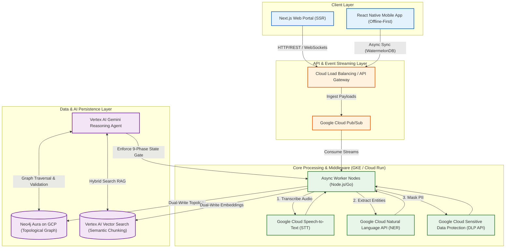

# Unified Design Thinking Workbench - Core Architecture

This diagram illustrates the macro architecture of the Unified Design Thinking Workbench, optimized for Google Cloud Platform (GCP) services. It highlights the primary data flow from client ingestion through event streaming, processing middleware, and finally to the intelligent persistence layer.

