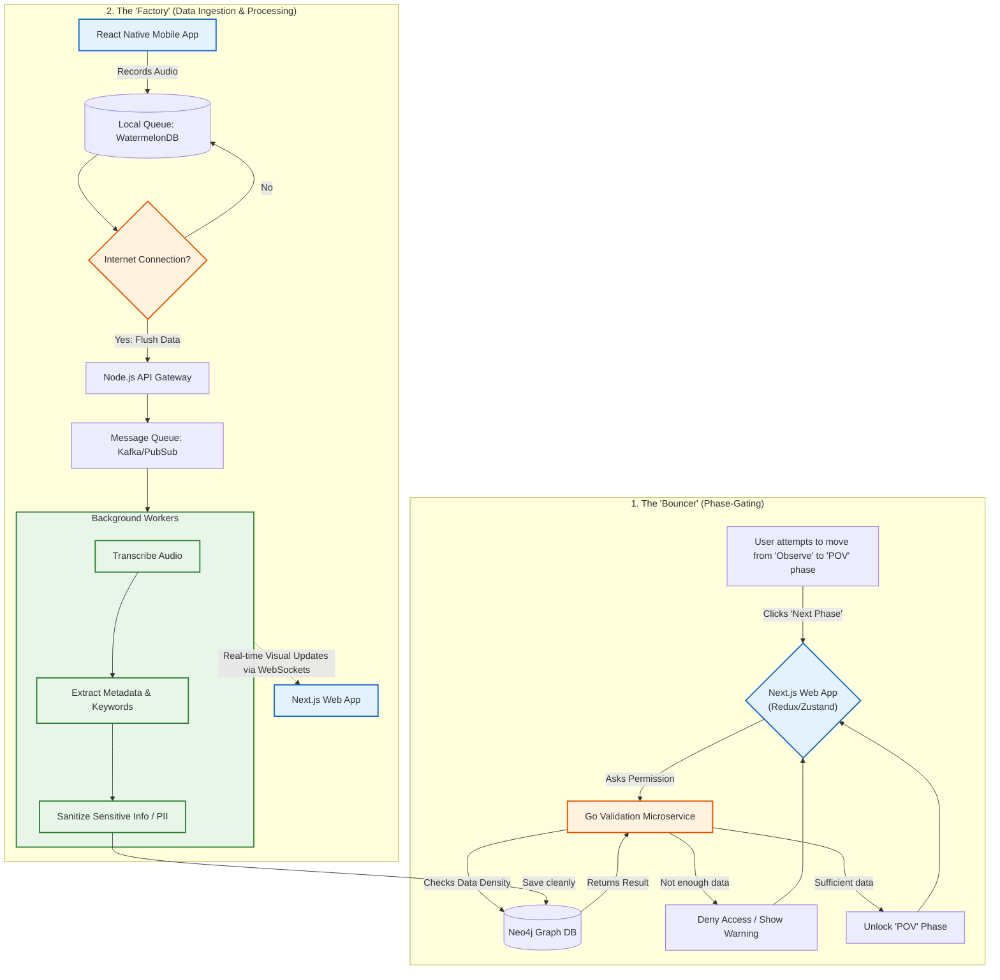

# UI/UX Mechanics & Data Flow

This diagram illustrates the two main concepts from this section: the strict rules for moving to the next project phase (**Phase-Gating**), and how the system automatically handles data in the background (**Asynchronous Processing**).

