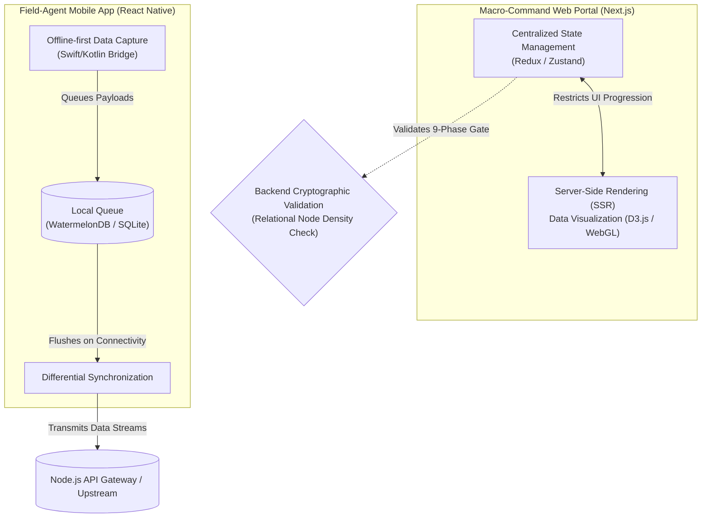

# 2.1 Client-Side Architecture Diagram

This diagram visualizes the bifurcated client layer of the Unified Design Thinking Workbench. It demonstrates how the rigid, state-gated Next.js macro-command portal interacts with the fluid, offline-first React Native mobile application. The architecture ensures that zero-friction edge capture seamlessly integrates with mathematically verified continuous state.

