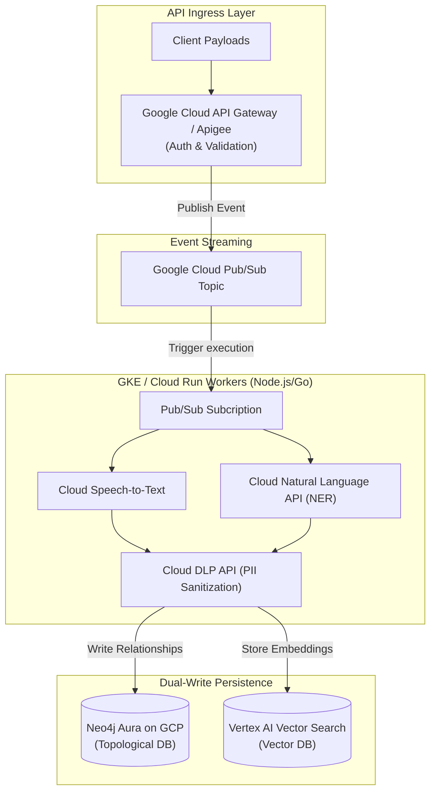

# 2.2 Backend & Middleware Infrastructure Diagram

This diagram illustrates the event-driven microservices architecture of the Workbench backend, optimized for Google Cloud Platform. It highlights the flow of ingested payloads from the API Gateway through high-throughput Pub/Sub streams, processing via asynchronous task workers, and PII sanitization before dual-writing to the underlying persistence layers.

