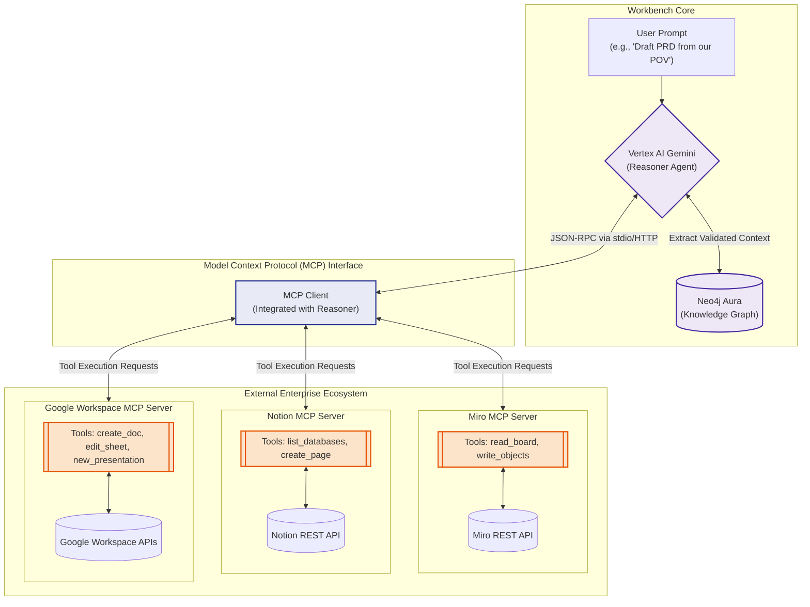

# 2.3 Third-Party Integration Strategy Diagram

This diagram showcases the integration of the Model Context Protocol (MCP) into the Workbench ecosystem. It demonstrates how the primary Vertex AI Gemini agent acts autonomously, invoking specific MCP tools to securely parse Miro spatial data and automatically draft and publish structural documents directly to Notion, removing the need for brittle middleware webhooks.

