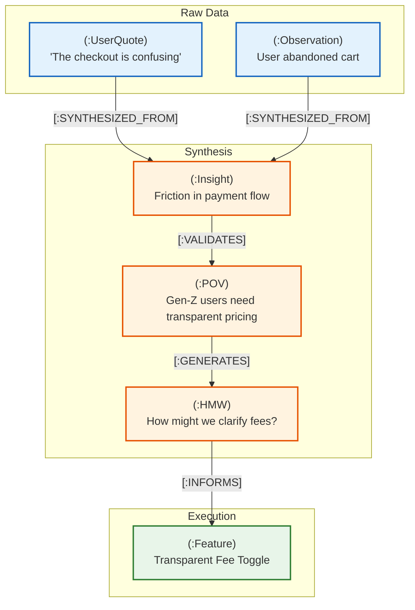

# 3.1 The Innovation Knowledge Graph Diagram

This diagram visualizes the topological structure of the Innovation Knowledge Graph built on Neo4j. It illustrates how discrete data points (like user quotes and observations) serve as foundational nodes that are explicitly tethered via strongly typed edges to synthesized insights and downstream product features, creating a mathematically queryable chain of custody.

