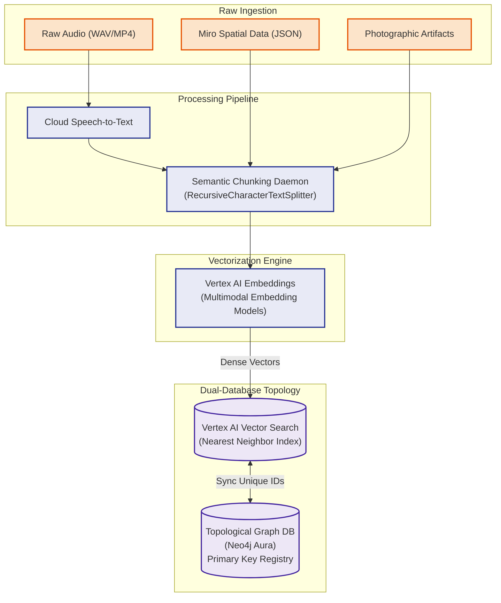

# 3.2 Multimodal Vectorization Diagram

This diagram demonstrates the multimodal vectorization pipeline of the Workbench. It shows the flow of unstructured qualitative assets through semantic chunking, high-dimensional embedding, and ultimately into the dual-database architecture where Pinecone (semantic vector search) and Neo4j (topological relationships) continuously synchronize.

