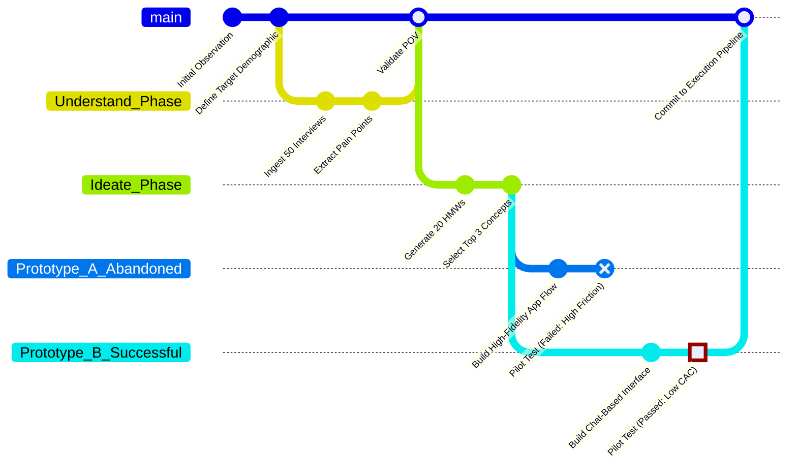

# 6.3 Strategic Pivoting & Version Control Diagram

This diagram visualizes the Git-like semantic versioning architecture applied directly to the Knowledge Graph within the Workbench. It demonstrates how enterprise teams can branch off experiments (e.g., prototypes), safely fail, and merge successful ideation branches while maintaining a cryptographically immutable record of the entire decision tree.

